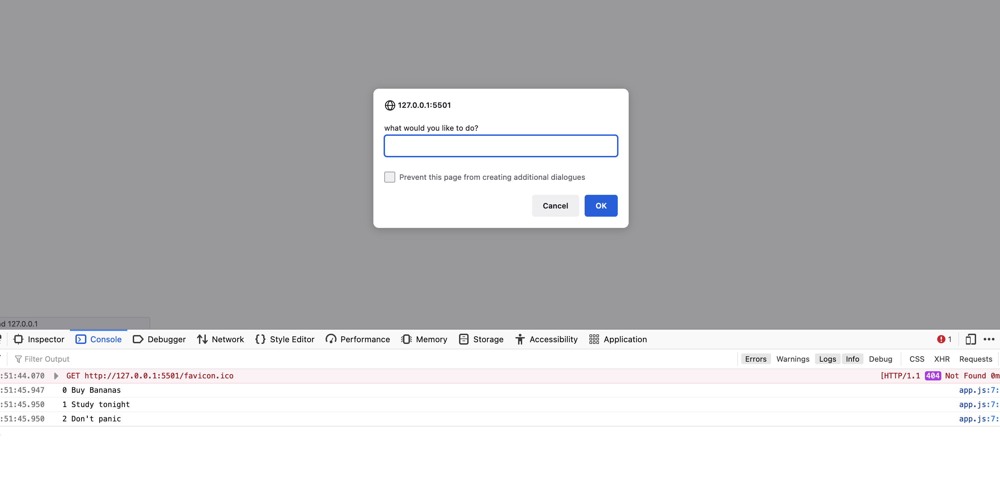

<h1 align="center">Notes App</h1>

 <a align="center" href="https://ctrlaltsudo.github.io/notes-console/">Live Demo</a>

<h2 align="center">Project Screenshot<h2>

  </img>

## Controls

Add - Adds an item to the list
List - Lists your notes
Delete - Delete entries 
Quit or q - Quit the app 

## Description

This is a notes app I created with what I've learnt from Colt Steels web developer course. 

## Built with 

Javascript

## What I learnt 

Instead of printing everything to the console I tried using the alert function, but then I realised that I can't display the whole array in one alert box, perhaps there is a way but I think the console will suffice for now. 

## Authors

<a href="https://github.com/CtrlAltSudo">CtrlAltSudo</a>.

## Acknowledgments

Colt is a great teacher, he explains everything in a way I can easily(most of the time) understand.